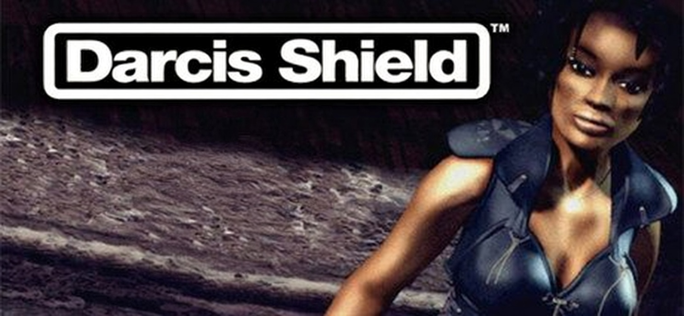

# Darcis Shield

**Darcis Shield** is a comprehensive modding and editing tool for the 1999 game **Urban Chaos**, built to make creating custom content faster, safer, and far more visual than editing files by hand.

### Supported Game File Types
- **`.ucm`** — Mission files  
- **`.iam`** — Map files  
- **`.lgt`** — Light files  
- **`.sty`** — Storyboard files (campaign scripting)

### Map Editor (`.iam`)
Create and modify maps with hands-on editing tools, including:
- Paint and replace **cell textures**
- Add / edit **buildings**
- Place **prim objects** (map objects / props)

### Light Editor (`.lgt`)
Tune the look and feel of a level by editing:
- Add / edit **light entries**
- Adjust map-wide lighting properties such as **prim colours**, **ambient colour**, and more

### Storyboard Editor (`.sty`)
Generate storyboard files to build:
- **Custom campaigns**
- Multi-mission story flows using `.sty` files

### Mission Editor (`.ucm`)
Design and tweak missions with features like:
- View and edit **Event Points**
- Construct and save **new missions**

---

Darcis Shield aims to be an all-in-one toolkit for Urban Chaos modding — covering maps, lighting, missions, and campaign structure in one place.
