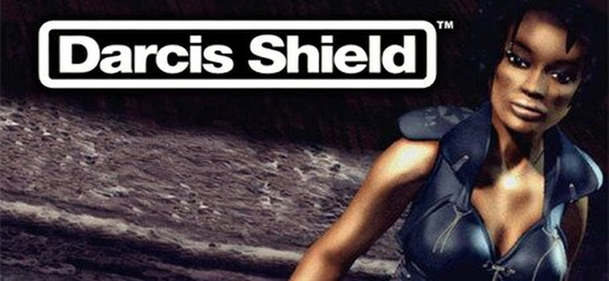

# Darcis Shield

**Darcis Shield** is a comprehensive editing and modding toolkit for the 1999 game **Urban Chaos**, designed to make custom content creation faster, safer, and far more visual than editing binary game files by hand.

It provides a modern workflow for working directly with several of the game’s core formats, with dedicated tools for maps, missions, lighting, storyboards, and object assets — all within one unified editor suite.

## Supported Game File Types

- **.ucm** — Mission files  
- **.iam** — Map files  
- **.map** — Roof texture data used alongside map files  
- **.lgt** — Light files  
- **.sty** — Storyboard files for campaign scripting  
- **.prm** — 3D object files  

## Map Editor (.iam / .map)

The Map Editor is the heart of Darcis Shield, offering a highly visual way to build and modify Urban Chaos maps.

### Terrain and Cell Editing
- Paint and replace ground cell textures
- Use an **eyedropper / sampler tool** to pick textures directly from the map
- Adjust terrain vertices to create:
  - hills
  - valleys
  - slopes
  - raised and lowered terrain
- Manually edit cell properties, including special cell states such as:
  - roof cells
  - interior cells

### Object / PRM Placement
- Place **PRM objects** directly onto the map
- Edit object properties including:
  - position
  - rotation
  - height
  - other placement-related settings
- View PRM graphics on the map with **pixel-perfect precision**
- Support for copying and pasting placed objects

### Building Editing
- Add and edit multiple building types, including:
  - warehouse / interior buildings
  - exterior decorative buildings
- Create and edit facets such as:
  - walls
  - fences
  - doors
  - gates
  - ladders
  - cables
- Filter building data by facet type for easier editing
- Paint building facets using:
  - base styles
  - custom painted styles
- Support for copying and pasting buildings

### Roofs, Walkables, and RF4
- Create standard and sloped roofs
- Manually add and edit **walkable containers**
- Manually add and edit **RF4 roof tiles**
- Paint **roof textures** via exported `.map` support
- Auto-create roofs for supported building layouts
- Auto-texture roofs
- Auto-fill walkables where applicable

### Visualisation and Workflow
- Includes a full **3D Visualiser** for rough real-time inspection of how the map may appear in-game
- Toggle individual map element layers on and off for focused editing
- Load directly from `.iam` files
- Save directly back to `.iam`
- Export matching `.map` data for roof texturing support
- Includes built-in help documentation

## Light Editor (.lgt)

The Light Editor allows detailed control over the visual atmosphere of a level by editing both individual light entries and broader map-wide lighting properties.

### Core Features
- Load and edit existing `.lgt` light files directly
- Manually edit overall map lighting properties
- Adjust **ambient lighting** values to control the general tone and brightness of the level
- Edit **day and night lighting behaviour**
- Modify the colour emitted by **light-emitting prims**
- Assign any colour and intensity to light data for custom visual effects

### Light Placement and Editing
- Edit individual light entries and light waypoints
- Control the colour, intensity, and placement of light data
- Fine-tune how lights contribute to the appearance of both the environment and placed objects

### Visual Editing Tools
- Multi-layer map view toggles, allowing lighting data to be viewed alongside other map elements
- Layer visibility can be switched on and off for clearer editing and better scene understanding

The Light Editor is designed to make level lighting much easier to preview and control, whether the goal is subtle atmosphere tuning or more dramatic visual effects.

## Style Editor (.tma / texture set tools)

The Style Editor provides support for building and modifying custom texture sets used by Urban Chaos, including both tile graphics and style/recipe data.

### Texture Set Creation
- Create entirely new custom texture sets
- Import single images
- Import batches of images
- Edit individual texture tiles directly
- Import the **sky image** used by the game’s skybox

### TMA / Style Editing
- Load and edit `.tma` files
- Work with wall recipe / wall style definitions
- Create custom wall base patterns and style arrangements

### Texture Properties
- Edit per-texture properties exported through `textype.txt`
- Control special texture behaviours such as:
  - transparency
  - self-illumination
  - and other supported texture flags
- Adjust the sound the player makes when stepping on a tile

### Export
- Export complete custom texture sets into a `WorldX` folder
- Generated texture sets can then be used directly by:
  - the Map Editor
  - the game engine

The Style Editor is intended to make custom world and texture-set creation much more practical, covering both the visual tiles themselves and the metadata that controls how those textures behave in-game.

## Mission Editor (.ucm)

The Mission Editor provides direct support for loading, inspecting, and modifying existing **Urban Chaos `.ucm` mission files**, giving a much more visual and practical workflow than editing mission data by hand.

### Core Features
- Load and edit existing `.ucm` mission files directly
- Create and save entirely new missions
- Edit mission-level properties such as:
  - mission name
  - map version
  - light version
  - crime rate
  - civilian rate
  - boredom rate
  - cars rate

### Event Point Editing
The Mission Editor supports editing across **every known Event Point type**, allowing detailed control over mission scripting and gameplay setup.

Supported Event Point workflows include:
- Create Player
- Create and adjust NPCs
- Create creatures
- Create bonus items
- Create cinematics
- Create visual effects
- and many other mission event types

### Visual Editing and Mission Layout
- Multi-layer visibility toggles, similar to the Map Editor, for switching mission elements on and off as needed
- Copy and paste support for Event Points
- Zone editing tools, including the ability to:
  - manually mark and unmark zones
  - define **No Go Zones** where players cannot enter
  - edit mission scripting zones such as specific colour-coded areas used by Event Point logic

### Accuracy and Context
- Load corresponding **Light files** to display light positions within the mission for better placement accuracy and clearer spatial context
- Provides a more complete mission editing environment by allowing mission logic to be viewed in relation to map and lighting data

## Storyboard Editor (.sty)

Build campaign flow and mission progression using storyboard files.

### Features
- Generate and edit `.sty` files
- Create custom campaigns
- Build multi-mission story flows

## PRM Support (.prm)

Darcis Shield also supports working with the game’s 3D object assets.

### Features
- Load and inspect PRM object files
- Use PRMs directly in map editing workflows
- Visualise object placement accurately on the map

## Project Goal

Darcis Shield aims to be an **all-in-one Urban Chaos modding toolkit**, bringing maps, lighting, missions, storyboards, and object placement into a single visual workflow.

The goal is not just to expose file data, but to make working with Urban Chaos content more practical, more precise, and significantly more approachable than traditional manual editing.
